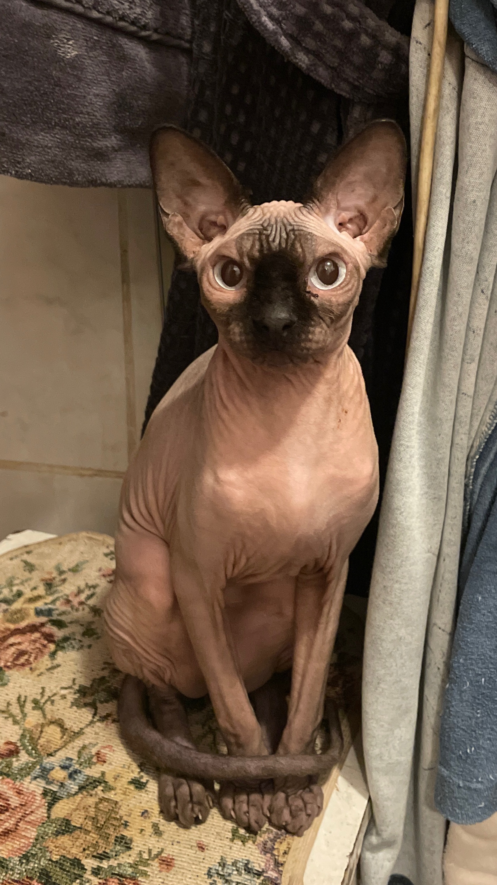

# Привет, меня зовут Диана!

Мне 21 год, живу в городе Москва. Работаю фармацевтом на протяжении 3-х лет. В этом году я окончательно решила, что это полностью не моё, поэтому решила податься в программирование, так как мечтала об этом будучи ребёнком (немного странно, многие девочки в детстве говорят, что будут учителями, а я сказала маме, что буду программистом).

Учёба даётся не то чтобы легко, но и не очень трудно. После каждой лекции встаёшь с пустой головой, но потом тебя отпускает и ловишь кайф, это мой небольшой наркотик)))

Своё фото прикреплять не буду (стесняюсь), поэтому ловите мою кошечку Текиллу 

